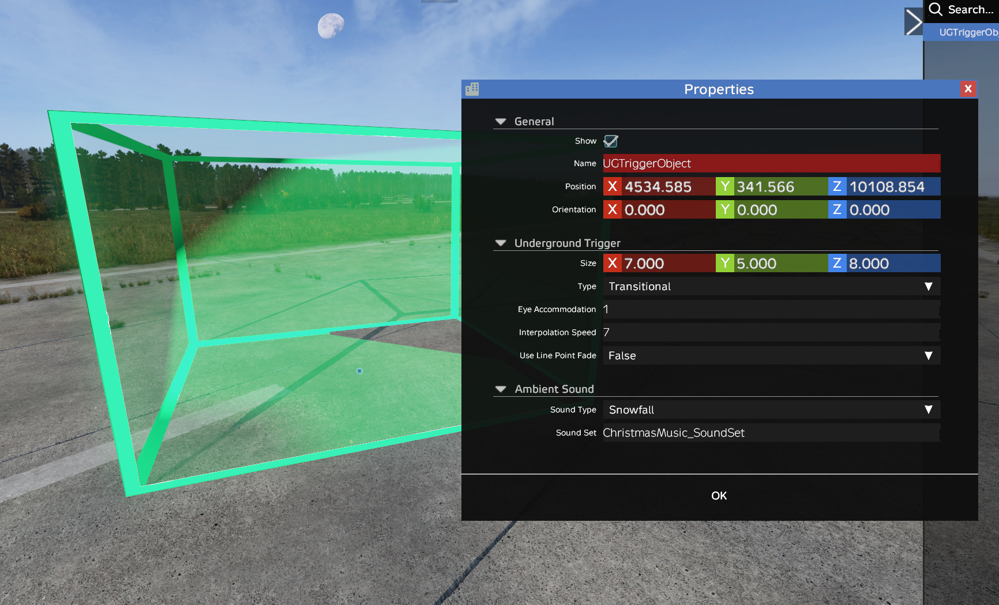
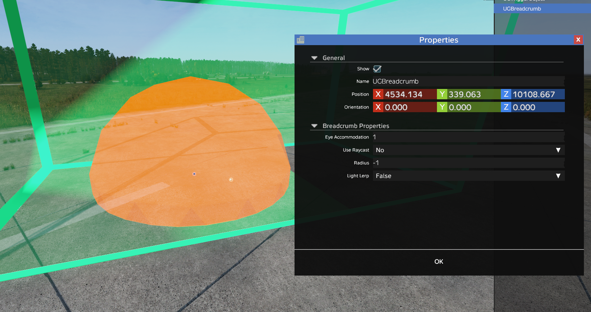
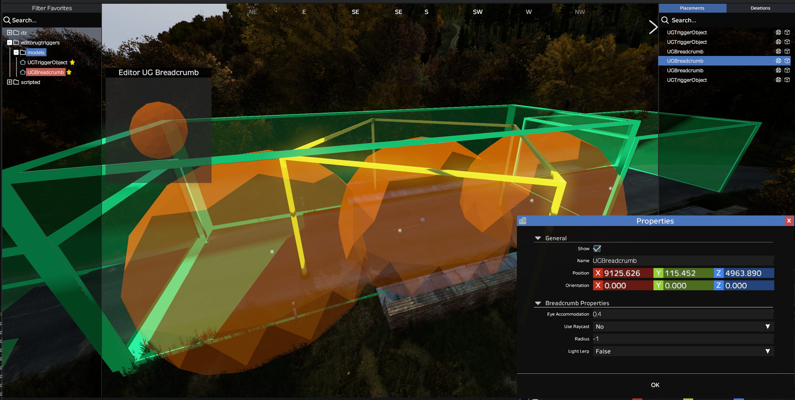

# Underground Trigger Creator for DayZ Editor

<p align="center">
  
</p>

[](https://creativecommons.org/licenses/by-nd/4.0/)
[](https://steamcommunity.com/sharedfiles/filedetails/?id=3547799357)
[](https://github.com/bauvdel/EditorUGTriggers)

> Create, test, import, and export fully functional Underground Triggers with Breadcrumbs right inside of DayZ Editor!

---

## Screenshots

| Trigger Properties | Breadcrumb Properties | Breadcrumbs in Trigger | Testing Darkness | Livonia Example |
|-----------------------|----------------------|------------------------|----------------------|------------------------------|
| [](docs/screenshot1.png) | [](docs/screenshot4.png) | [](docs/screenshot2.png) | [](docs/screenshot5.png) | [](docs/screenshot6.png) |


## Tutorial Videos
| bauvdel's Video | JinieJ's Video |
|-----------------------|----------------------|
| [](https://www.youtube.com/watch?v=00fqSRH4lyU)| [](https://www.youtube.com/watch?v=scCh_MT0ie8) |


---

## Features

### Core
- Create and test **live working Underground Triggers** directly in DayZ Editor.
- Size triggers **independently** on **X, Y, and Z axes**.
- Configure **Trigger Type** (Outer, Inner, Transitional), **Eye Accommodation**, and **Interpolation Speed**.
- Breadcrumbs automatically attach to **Transitional Triggers**.
- Export and import your **cfgundergroundtriggers.json** — works for both **PC** and **Console** edits!
- No need to use or learn **DayZ Diag**!

### Lighting & Darkness
- **LinePointFade Mode** — switch between standard (open cave) and linear path (tunnel/corridor) eye accommodation modes.
- **LightLerp** — trigger smooth world lighting darkening animations as players move between breadcrumbs. Fast darken (~0.2s), slow brighten (~0.6s).
- **Breadcrumb Visual Scaling** — breadcrumbs scale in the editor to match their Radius, so you can see coverage at a glance.

### Audio
- **AmbientSoundType** — choose from 22 engine sound controllers (e.g. `caveBig`, `caveSmall`) to fade in cave sounds and suppress outdoor sounds.
- **AmbientSoundSet** — layer custom looping audio (e.g. `Underground_SoundSet`, `Bunker_Ventilation_SoundSet`) on any trigger.

### Editing
- **Custom Clipboard** — Copy, Paste, Cut, and Duplicate triggers and breadcrumbs with full property preservation.
- **Undo/Redo** — snapshot-based property restoration for trigger edits.

---

## Requirements

- [Dabs Framework](https://steamcommunity.com/sharedfiles/filedetails/?id=2545327648)  
- [DayZ Editor](https://steamcommunity.com/sharedfiles/filedetails/?id=2250764298)  

> **IMPORTANT:** This mod is for **DayZ Editor use only** — not intended to run on a server or standalone and will NOT work. 

---

## Installation

**Steam Workshop**  
Subscribe on Steam Workshop: [Workshop Link](https://steamcommunity.com/sharedfiles/filedetails/?id=3547799357)

**Manual**  
1. Clone or download this repository.
2. Pack mod using Addon Builder, Mikeros, etc.  
2. Place .pbo in a `addons` folder insdie of a `@EditorUGTriggers` folder in your DayZ mods directory, or wherever you want to load local mods from.  
3. Load **DayZ Editor** and **Dabs Framework** at a minimum to allow this mod to function.

---

### How do Underground Triggers Work?
Read the **Bohemia Wiki Page:** [Underground Areas Configuration](https://community.bistudio.com/wiki/DayZ:Underground_Areas_Configuration)

---
## Usage
### Placing Triggers
1. Place a `UGTriggerObject`.
2. Adjust **position**, **rotation**, and **size** (X, Y, Z).
3. Set:
   - **Trigger Type**: Outer, Inner, Transitional
   - **Eye Accommodation** (0.0–1.0)
   - **Interpolation Speed** (0.0–1.0)
   - **UseLinePointFade** (True or False) — enables linear path mode for tunnels/corridors
   - **AmbientSoundType** (dropdown) — 22 engine sound controllers for environmental audio
   - **AmbientSoundSet** (text) — custom looping audio (e.g. `Underground_SoundSet`)

### Placing Breadcrumbs
1. Place `UGBreadcrumb` **inside a Transitional Trigger**.
2. Adjust position.
3. Breadcrumbs now **visually scale** based on their Radius — making coverage easy to see at a glance.
4. Set:
   - **Eye Accommodation** (0.0–1.0)
   - **Use Raycast** (True or False) — only used when UseLinePointFade = false
   - **Radius** (-1 = default 5m) — only used when UseLinePointFade = false
   - **LightLerp** (0 or 1) — world lighting darkening, only used when UseLinePointFade = true

### Copy/Paste/Cut/Duplicate
1. All **Trigger** and **Breadcrumb** objects should be Copied, Pasted, Cut, and Duplicated using the modded clipboard system to keep the triggers and data saved.
2. Use **Modifier** key <kbd>Shift</kbd> instead of <kbd>CTRL</kbd> with the default cut, copy, paste, and duplicate keybinds (<kbd>C</kbd> , <kbd>V</kbd>,  <kbd>X</kbd>, <kbd>J</kbd>)
3. All keybinds listed below. 

### Import/Export
- Importing and Exporting is done through the Editor File Menu, just as if you were importing or exporting anything else. 
- Look for the Import/Export UG Triggers (*.json) option in the menu. 
- Triggers and breadcrumbs can ONLY be saved this way. Saving them as a .dze will not make them work.

---

## Default Keybinds

- **Keybinds** can be adjusted in the Options Menu. We know that not everyone has a numpad!

**Trigger Resizing**

| Action            | Keybind  |
|-------------------|----------|
| Decrease Length   | Numpad <kbd>7</kbd> |
| Increase Length   | Numpad <kbd>9</kbd> |
| Decrease Width    | Numpad <kbd>4</kbd> |
| Increase Width    | Numpad <kbd>6</kbd> |
| Decrease Height   | Numpad <kbd>1</kbd> |
| Increase Height   | Numpad <kbd>3</kbd> |

- **Size** can also be adjusted in the UGTriggerObject Properties Window.

**Trigger/Breadcrumb Commands**
| Action             | Keybind  |
|--------------------|----------|
| Copy Triggers       | <kbd>Shift</kbd> + <kbd>C</kbd> |
| Paste Triggers      | <kbd>Shift</kbd> + <kbd>V</kbd> |
| Cut Triggers        | <kbd>Shift</kbd> + <kbd>X</kbd> |
| Duplicate Triggers  | <kbd>Shift</kbd> + <kbd>J</kbd> |
| Select All Triggers | <kbd>Shift</kbd> + <kbd>B</kbd> |

>IMPORTANT: Due to the way Copy/Cut/Paste work, you may run in to some issues with the objects repopulating their properties if using Undo/Redo functions within Editor.

---

## Import / Export

Files are imported/exported from the default **DayZ Editor** files directory.  

# Default export format:

```json
{
    "Triggers": [
        {
            "Position": [
                5351.25537109375,
                339.27191162109377,
                9558.80859375
            ],
            "Orientation": [
                0.0,
                0.0,
                -0.0
            ],
            "Size": [
                4.0,
                3.0,
                4.0
            ],
            "EyeAccommodation": 1.0,
            "InterpolationSpeed": 1.0,
            "UseLinePointFade": 0,
            "AmbientSoundType": "",
            "AmbientSoundSet": "",
            "Breadcrumbs": [
                {
                    "Position": [
                        5350.4609375,
                        337.9962158203125,
                        9558.0341796875
                    ],
                    "EyeAccommodation": 1.0,
                    "UseRaycast": 1,
                    "Radius": -1.0,
                    "LightLerp": 0
                },
                {
                    "Position": [
                        5351.9423828125,
                        337.9580383300781,
                        9558.0771484375
                    ],
                    "EyeAccommodation": 1.0,
                    "UseRaycast": 1,
                    "Radius": -1.0,
                    "LightLerp": 0
                }
            ]
        }
    ]
}
```
## Cleanup Triggers
Checkbox option to remove Triggers after export to clean up a .dze file before saving on top of custom builds.
>IMPORTANT: THIS WILL DELETE YOUR TRIGGERS AND BREADCRUMBS. DO NOT RELY ON UNDO! YOU'VE BEEN WARNED!

---

## Suggested Workflow

Typical underground trigger setup:
1. Start with **Outer Trigger** at entrance.
2. Pass through **Transitional Trigger** (with Breadcrumbs).
3. End in **Inner Trigger** at deepest point.
4. For alternate exits, add another **Transitional** → **Outer** path.
>Please read the **Bohemia Wiki Page:** [Underground Areas Configuration](https://community.bistudio.com/wiki/DayZ:Underground_Areas_Configuration) for more information.

---

## LinePointFade Mode

`UseLinePointFade` is a **trigger property** that changes how eye accommodation is calculated from breadcrumbs. 

### Two Calculation Modes

**Standard Mode (UseLinePointFade = false)** — DEFAULT
- All nearby breadcrumbs within range influence the player simultaneously
- Each breadcrumb's **Radius** acts as a cutoff distance (`-1` = engine default 5m)
- Remaining breadcrumbs are weighted by inverse distance (closer = stronger)
- **UseRaycast** is checked per-breadcrumb — blocks influence through walls/floors
- Works with 1+ breadcrumbs (max 32)

**LinePointFade Mode (UseLinePointFade = true)**
- Breadcrumbs form an ordered path (first = entrance, last = deepest point)
- Eye accommodation interpolates between the two closest breadcrumbs
- **Radius and UseRaycast are ignored** — only position matters
- Requires **minimum 2 breadcrumbs**

---

## LightLerp (Lighting Transitions)

`LightLerp` is a **breadcrumb property** that triggers smooth **lighting darkening animations** as players move through underground areas.

- **ONLY works with UseLinePointFade = true** and **minimum 2 breadcrumbs**
- `0` = Normal/bright lighting (near surface), `1` = Dark lighting state (deeper underground)
- Darkening is fast (~0.2s), brightening is slower (~0.6s) for realism
- Works independently from EyeAccommodation — both effects stack

**Example:**
```
[BC1: EyeAcco 0.2, LightLerp 0] → [BC2: EyeAcco 0.0, LightLerp 0] → [BC3: EyeAcco 0.0, LightLerp 1]
         Near entrance                    Getting darker                 WORLD LIGHTING DARKENS
```

| Property | Controls | Range |
|----------|----------|-------|
| **EyeAccommodation** | Pupil dilation / exposure | 0.0 (dark) to 1.0 (bright) |
| **LightLerp** | World lighting darkening | 0 (normal) or 1 (dark) |

> **Note**: EyeAccommodation 1.0 = bright, LightLerp 1 = dark — they work in opposite directions!

---

## Sound Properties

Underground triggers support **layered audio** with two property types:

### AmbientSoundType
Overrides a named volume controller in DayZ's sound engine. Setting one to 1.0 fades in all SoundShaders tied to that controller while fading out those that subtract it.

**Sound Controllers (22):**

<details>
<summary>Click to expand full controller reference with volume expressions</summary>

All data sourced from `\DZ\sounds\hpp\config.cpp`. SoundShader names and volume expressions are shown exactly as they appear in the engine config.

#### `caveBig`

**Fades IN** (5):

| SoundShader | Volume Expression |
|---|---|
| `Sakhal_bigCave_SoundShader` | `volume = "caveBig"` |
| `Sakhal_CaveWaterDrops_SoundShader` | `volume = "caveBig"` |
| `Sakhal_WindBigCaveLight_SoundShader` | `volume = "caveBig * (0.55 * (windy factor[0.15, 0.30]))"` |
| `Sakhal_WindBigCaveHeavy_SoundShader` | `volume = "caveBig * (windy factor[0.50, 0.80])"` |
| `Sakhal_bigCave3DProcessingType` | `volumeAll = "0.5 + 0.5*caveBig*caveBig"` |

**Fades OUT** (15) — via `* 1 - (caveSmall + caveBig) * 1` or `* (1 - caveBig)`:

| SoundShader |
|---|
| `Sakhal_ForestDay_SoundShader` |
| `Sakhal_ForestNight_SoundShader` |
| `Sakhal_MeadowDay_SoundShader` |
| `Sakhal_WindForestLight_SoundShader` |
| `Sakhal_WindForestHeavy_SoundShader` |
| `Sakhal_WindHousesLight_SoundShader` |
| `Sakhal_WindHousesHeavy_SoundShader` |
| `Sakhal_WindMeadowsLight_SoundShader` |
| `Sakhal_WindMeadowsHeavy_SoundShader` |
| `Sakhal_WindCoastHeavy_SoundShader` |
| `Sakhal_WindSeatHeavy_SoundShader` |
| `UrbanTree_Birds_Day_SoundShader` |
| `Forest_Coniferous_Birds_Day_SoundShader` |
| `Forest_Birds_Day_SoundShader` |
| `Forest_Birds_Night_SoundShader` |

---

#### `caveSmall`

**Fades IN** (4):

| SoundShader | Volume Expression |
|---|---|
| `Sakhal_smallCave_SoundShader` | `volume = "caveSmall"` |
| `Sakhal_WindSmallCaveLight_SoundShader` | `volume = "caveSmall * (0.55 * (windy factor[0.15, 0.30]))"` |
| `Sakhal_WindSmallCaveHeavy_SoundShader` | `volume = "caveSmall * (windy factor[0.50, 0.80])"` |
| `Sakhal_smallCave3DProcessingType` | `volumeAll = "0.5 + 0.5*caveSmall*caveSmall"` |

**Fades OUT**: Same 15 SoundShaders as `caveBig` — they share the `- (caveSmall + caveBig)` subtraction.

---

#### `houses`

Does NOT suppress outdoor sounds. Shifts the biome-proportional mix via `(houses/(forest + houses + meadows + sea + trees))`.

**Fades IN** (121):

| SoundShader | Volume Expression |
|---|---|
| `Houses3DProcessingType` | `volumeAll = "0.5 + 0.5*houses*houses"` |
| `base_tailHouses_SoundShader` | `volume = "(houses/(forest + houses + meadows + sea + trees)) * (1-interior)"` |
| `HousesDay_SoundShader` | `volume = "... * (( 1.6 * houses ) / ( houses + 0.6 )) / (...) * ..."` |
| `HousesNight_SoundShader` | `volume = "... * (( 1.6 * houses ) / ( houses + 0.6 )) / (...) * ..."` |
| + 117 weapon tail SoundShaders | All use `(houses/(forest + houses + meadows + sea + trees))` |

**Fades OUT**: Nothing directly.

---

#### `forest`

Shifts the biome-proportional mix via `(forest/(forest + houses + meadows + sea + trees))`.

**Fades IN** (106):

| SoundShader | Volume Expression |
|---|---|
| `Forest3DProcessingType` | `volumeAll = "0.5 + 0.5*forest*forest"` |
| `base_tailForest_SoundShader` | `volume = "(forest/(forest + houses + meadows + sea + trees)) * (1-interior)"` |
| `ForestDay_SoundShader` | `volume = "... * (( 1.6 * trees ) / ( trees + 0.6 )) / (...) * ..."` |
| `ForestDayBirds_SoundShader` | `volume = "0.25 * (( 1.6 * forest ) / ( forest + 0.6 )) * ..."` |
| + 102 weapon tail SoundShaders | All use `(forest/(forest + houses + meadows + sea + trees))` |

**Fades OUT** (2):

| SoundShader | Volume Expression |
|---|---|
| `Sakhal_SnowFall_HousesMedium_SoundShader` | `volume = "(1 - forest) * snowfall * ..."` |
| `Sakhal_SnowFall_HousesHeavy_SoundShader` | `volume = "(1 - forest) * (snowfall factor[0.55, 0.85]) * ..."` |

---

#### `meadow`

Shifts the biome-proportional mix via `(meadows/(forest + houses + meadows + sea + trees))`.

**Fades IN** (123):

| SoundShader | Volume Expression |
|---|---|
| `Meadow3DProcessingType` | `volumeAll = "0.5 + 0.5*meadow*meadow"` |
| `base_tailMeadows_SoundShader` | `volume = "((meadows + sea)/(forest + houses + meadows + sea + trees)) * (1-interior)"` |
| `MeadowDay_SoundShader` | `volume = "... * (( 1.6 * meadow ) / ( meadow + 0.6 )) / (...) * ..."` |
| `MeadowDayCrickets_SoundShader` | `volume = "(( 1.6 * meadow ) / ( meadow + 0.6 )) * ..."` |
| `MeadowNight_SoundShader` | `volume = "... * (( 1.6 * meadow ) / ( meadow + 0.6 )) / (...) * ..."` |
| + 118 weapon tail SoundShaders | All use `(meadows/(forest + houses + meadows + sea + trees))` |

**Fades OUT**: Nothing directly.

---

#### `trees`

Shifts the biome-proportional mix via `(trees/(forest + houses + meadows + sea + trees))`.

**Fades IN** (106):

| SoundShader | Volume Expression |
|---|---|
| `base_tailTrees_SoundShader` | `volume = "(trees/(forest + houses + meadows + sea + trees)) * (1-interior)"` |
| `WindForestLight_SoundShader` | `volume = "(0.55 * (windy factor[0.15, 0.30])) * (( 2 * trees ) / ( trees + 1 )) * ..."` |
| `WindForestHeavy_SoundShader` | `volume = "(windy factor[0.50, 0.80]) * (( 2 * trees ) / ( trees + 1 )) * ..."` |
| + 103 weapon tail SoundShaders | All use `(trees/(forest + houses + meadows + sea + trees))` |

**Fades OUT**: Nothing directly.

---

#### `coast`

**Fades IN** (7):

| SoundShader | Volume Expression |
|---|---|
| `Coast3DProcessingType` | `volumeAll = "coast"` |
| `Sakhal_Coast3DProcessingType` | `volumeAll = "coast"` |
| `Coast_SoundShader` | `volume = "(((altitudeSea - altitudeGround) factor[4.5,1]) max ((coast factor [0.955,1]) / 1.5)) * (sea factor[0.1,0.2]) * (altitudeSea factor[15,10]) * (houses factor[1,0.9]) * (waterDepth factor[15,10])"` |
| `Sakhal_Coast_SoundShader` | `volume = "((coast factor [0.1,0.9]) / 1.5) * (altitudeSea factor[20,3])"` |
| `Sakhal_WindCoastHeavy_SoundShader` | `volume = "(( 1.6 * coast ) / ( coast + 0.6 )) * (windy factor[0.50, 0.80]) * 1 - (caveSmall + caveBig) * 1"` |
| `Sakhal_Coast_Birds_SeaEagle_Day_SoundShader` | `volume = "(coast factor[0.1,0.9]) * (1 - night) * (sea factor[0.1,0.2]) * (waterDepth factor[15,10]) * ..."` |
| `Sakhal_Coast_bird_Glaucous_Gull_SoundShader` | `volume = "(coast factor[0.1,0.9]) * (1 - night) * (sea factor[0.1,0.2]) * (waterDepth factor[15,10]) * ..."` |

**Fades OUT**: Nothing directly.

---

#### `sea`

Shifts the biome-proportional mix via `(sea/(forest + houses + meadows + sea + trees))`.

**Fades IN** (122):

| SoundShader | Volume Expression |
|---|---|
| `Sea_SoundShader` | `volume = "(waterDepth factor [10,15]) * (waterDepth factor [25,18]) * (sea factor[0.5,0.9])"` |
| `base_tailMeadows_SoundShader` | `volume = "((meadows + sea)/(forest + houses + meadows + sea + trees)) * (1-interior)"` |
| + 120 weapon tail SoundShaders | All use `(sea/(forest + houses + meadows + sea + trees))` |

**Fades OUT**: Nothing directly.

---

#### `waterDepth`

Uses `factor` expressions — not a simple on/off.

**References** (7):

| SoundShader | Volume Expression |
|---|---|
| `Sea_SoundShader` | `volume = "(waterDepth factor [10,15]) * (waterDepth factor [25,18]) * (sea factor[0.5,0.9])"` |
| `Coast_SoundShader` | `volume = "... * (waterDepth factor[15,10])"` |
| `WindHousesLight_SoundShader` | `volume = "... * (1-0.75*(waterDepth factor[10,20])) * ..."` |
| `WindHousesHeavy_SoundShader` | `volume = "... * (1-0.75*(waterDepth factor[10,20])) * ..."` |
| `Sakhal_WindHousesLight_SoundShader` | `volume = "... * (1-0.75*(waterDepth factor[10,20])) * ..."` |
| `Sakhal_WindHousesHeavy_SoundShader` | `volume = "... * (1-0.75*(waterDepth factor[10,20])) * ..."` |
| `Sakhal_Coast_Birds_SeaEagle_Day_SoundShader` | `volume = "... * (waterDepth factor[15,10]) * ..."` |

---

#### `hills`

**Fades IN** (1):

| SoundShader | Volume Expression |
|---|---|
| `WindHills_SoundShader` | `volume = "(windy factor[0.6,1]) * (hills factor[0.5,1]) * 0.4 * (1 - 0.3*night)"` |

**Fades OUT**: Nothing.

---

#### `night`

**Fades IN** (24) — via `* (( 1.6 * night ) / ( night + 0.6 ))` or `* night`:

| SoundShader | Volume Expression |
|---|---|
| `ForestNight_SoundShader` | `volume = "... * (( 1.6 * night ) / ( night + 0.6 )) * (rain factor[0.3,0.1]) * (windy factor[0.5,0.2])"` |
| `HousesNight_SoundShader` | `volume = "... * (( 1.6 * night ) / ( night + 0.6 )) * (rain factor[0.3,0.1]) * (windy factor[0.4,0.1])"` |
| `MeadowNight_SoundShader` | `volume = "... * (( 1.6 * night ) / ( night + 0.6 )) * (rain factor[0.3,0.1]) * ..."` |
| `InsectNight_SoundShader` | `volume = "... * (( 1.6 * night ) / ( night + 0.6 )) * ..."` |
| + 20 more Sakhal night variants | Same pattern |

**Fades OUT** (14) — via `* (1 - night)`:

| SoundShader |
|---|
| `FlyAmbience_SoundShader` |
| `Sakhal_ForestDay_SoundShader` |
| `Sakhal_HousesDay_SoundShader` |
| `Sakhal_MeadowDay_SoundShader` |
| `UrbanTree_Birds_Day_SoundShader` |
| `Forest_Coniferous_Birds_Day_SoundShader` |
| `Forest_Birds_Day_SoundShader` |
| `Sakhal_ForestDayBirds_SoundShader` |
| `Sakhal_HousesDayBirds_SoundShader` |
| `Sakhal_Coast_Birds_SeaEagle_Day_SoundShader` |
| `Sakhal_Coast_bird_Glaucous_Gull_SoundShader` |
| `Sakhal_Sea_bird_Glaucous_Gull_SoundShader` |
| + 2 more |

---

#### Weather Controllers

| Controller | SoundShaders Referenced | Volume Pattern |
|---|---|---|
| `rain` | 203 | `(rain factor[0.7,0.4])` / `(rain factor[0.3,0.1])` |
| `windy` | 239 | `(windy factor[0.15, 0.30])` / `(windy factor[0.50, 0.80])` |
| `overcast` | 17 | `(overcast factor[0.8,0.6])` |
| `fog` | 17 | `(fog factor[0.9,0.4])` |
| `snowfall` | 17 | `(snowfall factor[0.8,0.6])` / `(snowfall factor [0.25, 1])` |
| `daytime` | 6 | `(daytime factor[0.6,0.58])` |
| `shooting` | 21 | `(shooting factor [0.6,1])` |

---

#### Altitude Controllers

| Controller | SoundShaders Referenced | Volume Pattern |
|---|---|---|
| `altitudeGround` | 4 | `(altitudeGround factor[15,10])` |
| `altitudeSea` | 4 | `(altitudeSea factor[15,10])` / `(altitudeSea factor[20,3])` |
| `altitudeSurface` | 0 | **No references in any SoundShader** |

---

#### `deadBody`

**Zero references** in any SoundShader volume expression. Accepted but has no effect as of now.

</details>

### AmbientSoundSet
Plays a specific SoundSet as a looping audio track on the player.

**Three conditions must ALL be met for a SoundSet to work:**

1. **Audio sample duration >= 6s** — The engine validates fade durations (hardcoded 3s in, 3s out) against the raw audio sample length *before* enabling loop mode. If any sample < 3s: `"FadeIn is longer than sound wave length"` — sound stopped. If any sample < 6s: `"FadeIn & FadeOut are longer than sound wave length"` — sound stopped.

2. **SoundShader volume must be a simple numeric value** — The underground handler calls `PlaySoundSetLoop` which goes through `CreateSound` with `enviroment = false`. This means `AddEnvSoundVariables()` is never called, so volume expressions that reference environment controllers (`interior`, `forest`, `trees`, `houses`, `rain`, `windy`, `caveBig`, `speed`, `rpm`, etc.) cannot be evaluated. Only SoundSets whose SoundShader has a purely numeric volume (e.g. `volume = 4.5`) will work.

3. **SoundShader must exist in config** — If the SoundSet references a SoundShader class that doesn't exist, no sound is created.

A SoundSet with multiple samples (e.g. `Bunker_Lamp_Hum_SoundSet` has 5 hum variants) randomly picks one each time. If some samples pass and others fail, the SoundSet works intermittently.

### Verified SoundSets*
**It's posisble that this is a non-exhaustive list. These soundsets just meet all three requirements set forth in the vanilla scripts. YMMV.

<details>
<summary>Click to expand full list (169 SoundSets — all samples >= 6s, simple numeric volume, valid SoundShader)</summary>

| SoundSet | Min Sample |
|----------|-----------|
| `100Hz_stereo_20s_SoundSet` | 17.5s |
| `1kHz_mono_10s_SoundSet` | 10.0s |
| `1kHz_mono_20s_SoundSet` | 20.0s |
| `1kHz_mono_30s_SoundSet` | 30.0s |
| `1kHz_mono_6s_SoundSet` | 6.0s |
| `1kHz_stereo_10s_SoundSet` | 10.0s |
| `1kHz_stereo_20s_SoundSet` | 20.0s |
| `1kHz_stereo_30s_SoundSet` | 30.0s |
| `1kHz_stereo_6s_SoundSet` | 6.0s |
| `AlarmClock_Ring_Loop_SoundSet` | 16.9s |
| `AnniversaryMusic_Intense_SoundSet` | 85.0s |
| `AnniversaryMusic_Light_SoundSet` | 61.4s |
| `Artillery_Close_SoundSet` | 16.6s |
| `Baking_Done_SoundSet` | 9.6s |
| `Baking_SoundSet` | 9.6s |
| `BarbedWire_Crafting_loop_SoundSet` | 14.3s |
| `BarbedWire_Deploy_loop_SoundSet` | 8.1s |
| `Boiling_Done_SoundSet` | 16.9s |
| `Boiling_SoundSet` | 13.3s |
| `Bunker_Ventilation_SoundSet` | 6.9s |
| `ChristmasMusic_SoundSet` | 91.3s |
| `CivilianSedan_fueltank_fill_SoundSet` | 7.3s |
| `Claymore_disarm_SoundSet` | 7.3s |
| `Claymore_disarm_long_SoundSet` | 13.1s |
| `ContaminatedArea_SoundSet` | 18.3s |
| `DeerAmbush1_SoundSet` | 7.0s |
| `DeerAmbush2_SoundSet` | 7.0s |
| `DeerAmbush3_SoundSet` | 7.0s |
| `DeerAmbush4_SoundSet` | 7.0s |
| `DeerAmbush5_SoundSet` | 7.0s |
| `DeerAmbush6_SoundSet` | 7.0s |
| `Drying_Done_SoundSet` | 13.3s |
| `Drying_SoundSet` | 9.3s |
| `ExtinguishByWater_SoundSet` | 16.8s |
| `Flies_SoundSet` | 24.5s |
| `Food_Burning_SoundSet` | 38.4s |
| `Geyser_bubbling_loop_SoundSet` | 14.1s |
| `Geyser_eruption_loop_SoundSet` | 11.0s |
| `Hatchback_02_fueltank_fill_SoundSet` | 7.3s |
| `HeavyFire_SoundSet` | 28.4s |
| `HeliCrash_Distant_SoundSet` | 24.9s |
| `ImprovisedExplosive_disarm_SoundSet` | 12.0s |
| `KitchenTimer_Ring_Loop_SoundSet` | 15.5s |
| `KitchenTimer_Ticking_Loop_SoundSet` | 12.1s |
| `LightFire_SoundSet` | 24.1s |
| `Music_Menu_2_SoundSet` | 173.8s |
| `Music_Menu_3_SoundSet` | 234.2s |
| `Music_Menu_4_SoundSet` | 239.5s |
| `Music_Menu_SoundSet` | 91.8s |
| `Music_Menu_subtitles_remake_SoundSet` | 120.0s |
| `Music_loc_aa_base_SoundSet` | 242.2s |
| `Music_loc_city_SoundSet` | 188.0s |
| `Music_loc_coast_SoundSet` | 185.1s |
| `Music_loc_contaminated_day_SoundSet` | 235.2s |
| `Music_loc_contaminated_night_SoundSet` | 253.3s |
| `Music_loc_dambog_SoundSet` | 187.7s |
| `Music_loc_industrial_SoundSet` | 254.4s |
| `Music_loc_naval_base_SoundSet` | 194.7s |
| `Music_loc_prison_SoundSet` | 185.9s |
| `Music_loc_sila_SoundSet` | 244.0s |
| `Music_loc_tisy_SoundSet` | 241.1s |
| `Music_loc_traffic_SoundSet` | 206.6s |
| `Music_loc_volcano_SoundSet` | 187.0s |
| `Music_loc_vybor_SoundSet` | 189.7s |
| `Music_time_dawn_1_SoundSet` | 234.2s |
| `Music_time_dawn_2_SoundSet` | 240.0s |
| `Music_time_day_1_SoundSet` | 246.7s |
| `Music_time_day_2_SoundSet` | 234.6s |
| `Music_time_day_3_SoundSet` | 240.0s |
| `Music_time_day_4_SoundSet` | 240.0s |
| `Music_time_day_5_SoundSet` | 240.0s |
| `Music_time_day_6_SoundSet` | 240.0s |
| `Music_time_day_7_SoundSet` | 240.0s |
| `Music_time_day_8_SoundSet` | 191.0s |
| `Music_time_dusk_1_SoundSet` | 240.9s |
| `Music_time_dusk_2_SoundSet` | 240.0s |
| `Music_time_night_1_SoundSet` | 244.8s |
| `Music_time_night_2_SoundSet` | 239.5s |
| `NoFuelFire_SoundSet` | 11.1s |
| `Sedan_02_fueltank_fill_SoundSet` | 7.3s |
| `SledgeCrash_Distant_SoundSet` | 22.2s |
| `SmokegGrenades_M18_active_loop_SoundSet` | 7.4s |
| `SmokegGrenades_M18_end_loop_SoundSet` | 7.4s |
| `SmokegGrenades_M18_start_loop_SoundSet` | 10.0s |
| `SmokegGrenades_RDG2_active_loop_SoundSet` | 7.4s |
| `SmokegGrenades_RDG2_end_loop_SoundSet` | 7.4s |
| `SmokegGrenades_RDG2_start_loop_SoundSet` | 10.0s |
| `SpookyArea_WhistlingWind_SoundSet` | 6.9s |
| `Test_WhiteNoise_20db_Stereo_SoundSet` | 7.4s |
| `ThunderHeavy_Far_SoundSet` | 15.4s |
| `ThunderHeavy_Near_SoundSet` | 16.7s |
| `ThunderNorm_Far_SoundSet` | 8.5s |
| `ThunderNorm_Near_SoundSet` | 7.1s |
| `Tinnitus_SoundSet` | 11.4s |
| `Truck_01_Horn_SoundSet` | 8.2s |
| `Underground_SoundSet` | 84.6s |
| `Warhead_Storage_Ambient_SoundSet` | 26.0s |
| `WolfHowl1_SoundSet` | 7.0s |
| `WolfHowl1_tailDistant_SoundSet` | 6.0s |
| `WolfHowl2_SoundSet` | 6.7s |
| `WolfHowl4_SoundSet` | 7.1s |
| `WolfHowl4_tailDistant_SoundSet` | 6.3s |
| `WolfHowl5_SoundSet` | 8.2s |
| `WolfHowl5_tailDistant_SoundSet` | 7.2s |
| `WolfHowl6_SoundSet` | 7.5s |
| `WolfHowl6_tailDistant_SoundSet` | 6.5s |
| `WolfHowl7_SoundSet` | 8.0s |
| `WolfHowl7_tailDistant_SoundSet` | 6.4s |
| `WolfHowl8_SoundSet` | 8.2s |
| `WolfHowl8_tailDistant_SoundSet` | 7.5s |
| `WolfHowls1_SoundSet` | 10.0s |
| `WolfHowls1_tailDistant_SoundSet` | 8.6s |
| `WolfHowls2_SoundSet` | 12.0s |
| `WolfHowls2_tailDistant_SoundSet` | 10.6s |
| `WolfHowls3_SoundSet` | 11.7s |
| `WolfHowls3_tailDistant_SoundSet` | 10.5s |
| `WolfHowls4_SoundSet` | 12.4s |
| `WolfHowls4_tailDistant_SoundSet` | 11.4s |
| `WolfHowls5_SoundSet` | 15.7s |
| `WolfHowls5_tailDistant_SoundSet` | 14.8s |
| `WolfHowls6_SoundSet` | 16.5s |
| `WolfHowls6_tailDistant_SoundSet` | 15.5s |
| `WolfHowls7_SoundSet` | 18.0s |
| `WolfHowls7_tailDistant_SoundSet` | 14.8s |
| `WolfHowls8_SoundSet` | 11.6s |
| `WolfHowls8_tailDistant_SoundSet` | 15.5s |
| `WolfHowls_SoundSet` | 10.0s |
| `barbedwire_deploy_SoundSet` | 8.1s |
| `baseradio_staticnoise_SoundSet` | 38.8s |
| `beartrap_deploy_SoundSet` | 7.1s |
| `boat_01_engine_stop_SoundSet` | 6.0s |
| `boat_01_engine_stop_no_fuel_SoundSet` | 6.0s |
| `bunker_door_brown_close_SoundSet` | 12.7s |
| `bunker_door_brown_open_SoundSet` | 13.4s |
| `bunker_door_silver_close_SoundSet` | 10.3s |
| `bunker_door_silver_open_SoundSet` | 8.5s |
| `buoy_floating_water_SoundSet` | 10.9s |
| `cartent_deploy_SoundSet` | 8.4s |
| `defibrillator_charge_SoundSet` | 15.1s |
| `emptyVessle_CanisterGasoline_SoundSet` | 21.9s |
| `emptyVessle_Canteen_SoundSet` | 27.9s |
| `emptyVessle_Pot_SoundSet` | 11.3s |
| `emptyVessle_WaterBottle_SoundSet` | 34.4s |
| `fishnet_deploy_SoundSet` | 17.8s |
| `fishtrap_deploy_SoundSet` | 17.5s |
| `hescobox_deploy_SoundSet` | 6.5s |
| `improvisedexplosive_deploy_SoundSet` | 6.3s |
| `landmine_deploy_SoundSet` | 8.3s |
| `largetent_deploy_SoundSet` | 8.4s |
| `mediumtent_deploy_SoundSet` | 8.4s |
| `offroad_02_fueltank_fill_SoundSet` | 7.3s |
| `offroad_fueltank_fill_SoundSet` | 7.3s |
| `partytent_deploy_SoundSet` | 6.6s |
| `pastransmitter_staticnoise_SoundSet` | 30.1s |
| `personalradio_staticnoise_SoundSet` | 15.0s |
| `portablegaslamp_burn_SoundSet` | 12.8s |
| `portablegasstove_burn_SoundSet` | 6.3s |
| `pour_HardGround_Canteen_SoundSet` | 11.4s |
| `pour_HardGround_GasolineCanister_SoundSet` | 11.5s |
| `pour_HardGround_Pot_SoundSet` | 11.5s |
| `pour_HardGround_WatterBottle_SoundSet` | 11.4s |
| `pour_SoftGround_Canteen_SoundSet` | 14.4s |
| `pour_SoftGround_WatterBottle_SoundSet` | 14.4s |
| `powerGeneratorLoop_SoundSet` | 13.2s |
| `powerGeneratorTurnOff_SoundSet` | 6.3s |
| `powerGenerator_low_Fuel_Loop_SoundSet` | 7.7s |
| `rabbitsnare_deploy_SoundSet` | 8.1s |
| `roadflareLoop_SoundSet` | 9.2s |
| `tripwiretrap_deploy_SoundSet` | 7.2s |

</details>

### How to Use AmbientSoundType

1. Select your **UGTriggerObject**
2. Open **Properties** panel
3. Find **AmbientSoundType** dropdown
4. Select a controller
5. The engine applies that controller's value to all SoundShader volume expressions that reference it

### How to Use AmbientSoundSet

1. Select your **UGTriggerObject**
2. Open **Properties** panel
3. Find **AmbientSoundSet** text field
4. Enter the exact SoundSet name (case-sensitive)
5. Example: `Underground_SoundSet`

---

## Quick Reference

### Decision Matrix

| I Want To... | UseLinePointFade | LightLerp | AmbientSoundType | AmbientSoundSet |
|-------------|------------------|-----------|------------------|------------------------|
| **Linear tunnel with smooth lighting** | true | Alternating 0/1 | `caveSmall` | Optional |
| **Open cave, any direction** | false | N/A (ignored) | `caveBig` | Optional |
| **Underwater area** | Either | If linear: alternate | `waterDepth` | Optional |
| **Military bunker** | true | Alternating 0/1 | `houses` | `Bunker_Ventilation_SoundSet` |
| **Mine shaft** | true | Alternating 0/1 | `caveSmall` | `Underground_SoundSet` |
| **Complex cave system** | false | N/A (ignored) | `caveBig` | `SpookyArea_WhistlingWind_SoundSet` |

### Property Quick Check

**Trigger-Level Properties:**
- UseLinePointFade (true/false) - Changes calculation mode
- InterpolationSpeed (float) - How fast EyeAccommodation transitions (default: 7, higher = faster)
- AmbientSoundType (dropdown) - 22 engine sound controllers
- AmbientSoundSet (text) - Custom audio loops

**Breadcrumb-Level Properties:**
- EyeAccommodation (0.0-1.0) - Darkness level (1.0 = bright, 0.0 = fully dark)
- Radius (number) - Influence cutoff distance in meters. Default -1 = 5m. Only used when UseLinePointFade = false
- LightLerp (0 or 1) - World lighting darkening. 0 = normal, 1 = dark. Only used when UseLinePointFade = true
- UseRaycast (true/false) - Exclude breadcrumb if terrain/building blocks line of sight. Only used when UseLinePointFade = false

### Which Properties Work in Which Mode

| Property | Standard Mode (false) | LinePointFade Mode (true) |
|----------|----------------------|--------------------------|
| EyeAccommodation | Weighted by distance | Interpolated along path |
| Radius | Cutoff distance | Ignored |
| UseRaycast | Blocks through walls | Ignored |
| LightLerp | Ignored | Triggers darkening animation |

### Lighting Zone Patterns

**Pattern 1: Surface to Deep**
```
Entrance → Transition → Deep Cave
LightLerp:   0    →    0    →    1
            (Normal)  (Normal) (TRANSITION to Dark)
```

**Pattern 2: Through and Out**
```
Entrance → Deep → Exit
    0    →  1  →  0
  (Normal → Dark → Normal again)
```

---

## Common Mistakes to Avoid

- **Setting LightLerp without enabling UseLinePointFade** — LightLerp is completely ignored in standard mode.
- **Confusing LightLerp and EyeAccommodation directions** — EyeAcco 1.0 = bright, LightLerp 1 = dark.
- **Using same LightLerp value on all breadcrumbs** — No transitions will occur. Use 0 for entrance, 1 for deep areas.
- **Not enough breadcrumbs for LinePointFade** — Need minimum 2. With 0-1, it falls back to standard mode.
- **Enabling UseLinePointFade on triggers without breadcrumbs** — Has no effect, just leave it disabled (false).
- **Using UseLinePointFade for open areas** — Standard mode (false) is better for multi-directional exploration.
- **Setting Radius expecting it to work in LinePointFade mode** — Radius is only used as a cutoff in standard mode. In LinePointFade, all breadcrumbs participate regardless of distance.

---

## Tips for Success

1. **Start Simple**: Use standard mode (UseLinePointFade: false) until comfortable
2. **Test Progression**: Walk through your triggers slowly to test transitions
3. **Watch the Scale**: Use breadcrumb visual scaling to plan coverage
4. **Layer Audio**: Combine SoundType + SoundSet for rich environments
5. **Plan Lighting Zones**: Use LightLerp to create distinct entrance/deep areas
6. **Experiment**: Try different combinations to find what works best

---

## Additional Resources

- **All SoundSets**: Browse `P:\DZ\sounds\hpp\config.cpp` (only SoundSets with simple numeric volume, valid SoundShader, and all samples >= 6s will work — see AmbientSoundSet section for details)
- **Bohemia Wiki**: [Underground Areas Configuration](https://community.bistudio.com/wiki/DayZ:Underground_Areas_Configuration)

---

## Help and Support

We both have full time jobs, but we will do our best to keep this updated and fix bugs as they happen. Please find us on discord or create an issue on GitHub!

**Discord:** **@bauvdel** & **@JinieJ**


---

## Credits

- Thank you to **@inclementdab** for creating DayZ Editor ❤️! 
[DayZ Editor on Steam Workshop](https://steamcommunity.com/sharedfiles/filedetails/?id=2250764298)
[DayZ Editor on Github](https://github.com/InclementDab/DayZ-Editor)

---

## License

[CC BY-ND 4.0](LICENSE) — Free to use, modify, and share non commercially..

> **No reason to repack. But you do you.**

---

## Donate

We created this project as we felt that there was a need for such a tool to curb the barrier to entry for a task like this. 
This was made in our spare time, and we plan to continue to support and update this tool as DayZ and DayZ Editor grow and change.
If you would like to support the project, or just want to say thanks, feel free to click the links below!

- [bauvdel on Ko-fi](https://ko-fi.com/bauvdel)
- [JinieJ on BMaC](https://buymeacoffee.com/jiniej)
